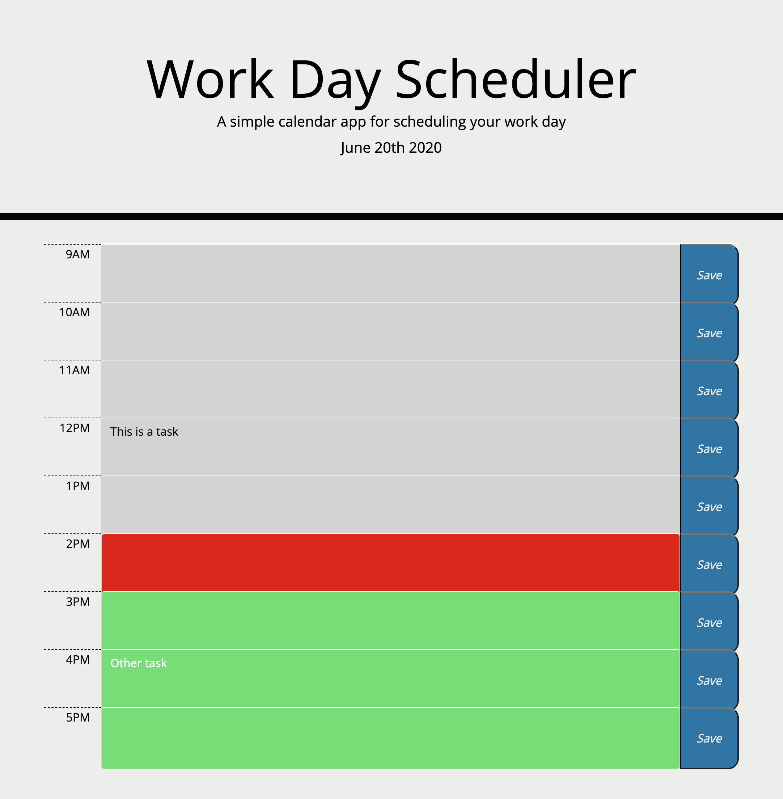

# workday-scheduler

The following is a scheduler to keep track of daily plans. The current time is displayed at the top for reference. To edit a task, click on a text input field, then click the save button to save the task. The task will then be saved and loaded for future reference.

The time blocks are also color coded to represent past time (gray), present time (red), and future time (green). The color of the time blocks change hourly.

## Technologies/Libraries used:
* Bootstrap
* jQuery
* Moment.js

## Deployment:
[d-belleza.github.io/workday-scheduler](http://d-belleza.github.io/workday-scheduler)

